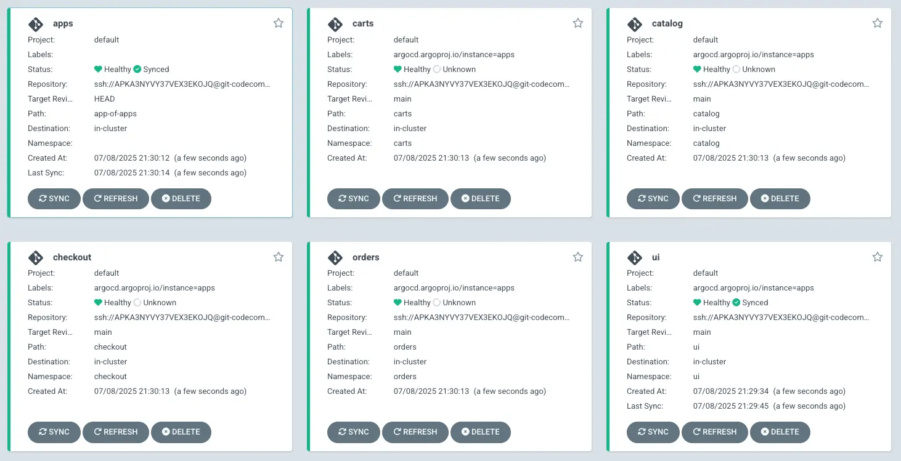

We'll create templates for set of ArgoCD applications using DRY approach in Helm charts:

```text
.
|-- app-of-apps
|   |-- Chart.yaml
|   |-- templates
|   |   |-- _application.yaml
|   |   `-- application.yaml
|   `-- values.yaml
|-- ui
`-- catalog
    ...
```

`_application.yaml` is a template file which will be used to dynamically create applications based on a list of component names:

<!-- prettier-ignore-start -->
::yaml{file="manifests/modules/automation/gitops/argocd/app-of-apps/templates/_application.yaml"}
<!-- prettier-ignore-end -->

`values.yaml` specifies a list of components for which ArgoCD applications will be generated, as well as configuration related to the Git repository common to all of the applications:

::yaml{file="manifests/modules/automation/gitops/argocd/app-of-apps/values.yaml"}

First, we'll copy this foundational App of Apps configuration which we described above to the Git directory:

```bash
$ cp -R ~/environment/eks-workshop/modules/automation/gitops/argocd/app-of-apps ~/environment/argocd/
$ yq -i ".spec.source.repoURL = env(GITOPS_REPO_URL_ARGOCD)" ~/environment/argocd/app-of-apps/values.yaml
```

Push the changes:

```bash wait=10
$ git -C ~/environment/argocd add .
$ git -C ~/environment/argocd commit -am "Adding App of Apps"
$ git -C ~/environment/argocd push
```

We'll need to create new a Argo CD Application to support the App of Apps pattern. While doing this we'll also enable ArgoCD to to automatically [synchronize](https://argo-cd.readthedocs.io/en/stable/user-guide/auto_sync/) the state in the cluster with the configuration in the Git repository using `--sync-policy automated`:

```bash
$ argocd app create apps --repo $GITOPS_REPO_URL_ARGOCD \
  --dest-server https://kubernetes.default.svc \
  --sync-policy automated --self-heal --auto-prune \
  --set-finalizer \
  --upsert \
  --path app-of-apps
 application 'apps' created
```

Open the Argo CD UI and navigate to the main "Applications" page:

```bash
$ argocd app sync apps
```

The App of Apps configuration has been deployed and synced, but except for the UI component all of the workload apps are marked as "Unknown".



We will deploy application configurations for the applications in the next step.
