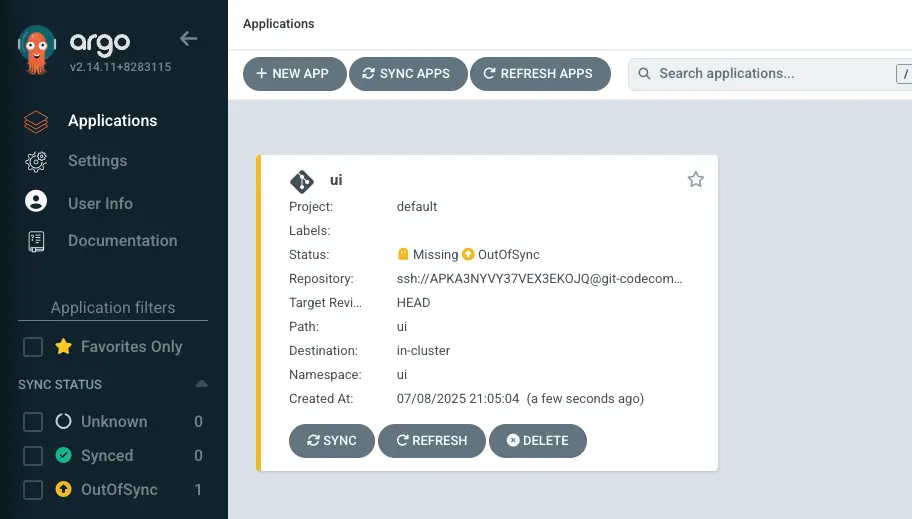
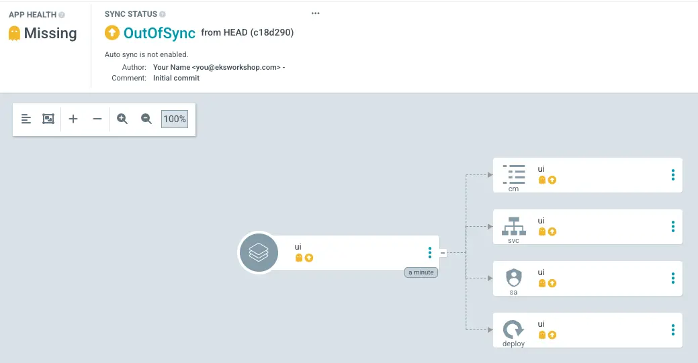
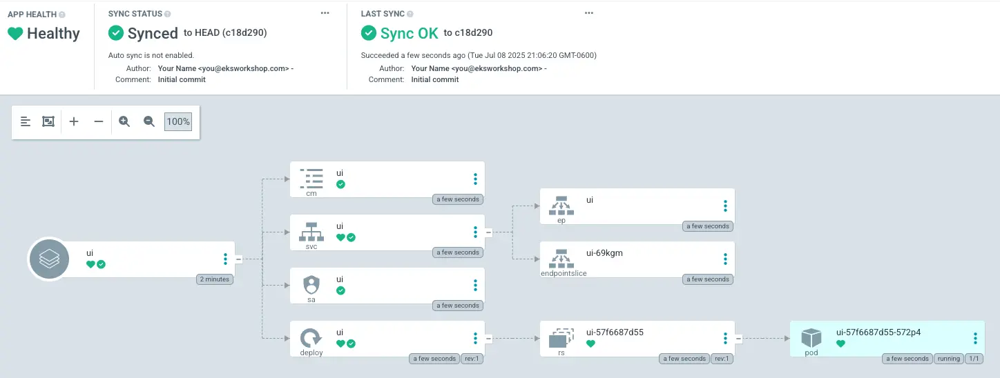

We have successfully configured Argo CD on our cluster so now we can deploy an application. To demonstrate the difference between a GitOps-based delivery of an application and other methods, we'll migrate the UI component of the sample application which is currently using the `kubectl apply -k` approach to the new Argo CD deployment approach.

An Argo CD application is a CRD resource object representing a deployed application instance in an environment. It defines key information about the application, such as the application name, the Git repository, and the path to the Kubernetes manifests. The application resource also defines the desired state of the application, such as the target revision, the sync policy, and the health check policy.

First remove the sample application from the cluster:

```bash
$ kubectl delete namespace -l app.kubernetes.io/created-by=eks-workshop
namespace "assets" deleted
namespace "carts" deleted
namespace "catalog" deleted
namespace "checkout" deleted
namespace "orders" deleted
namespace "other" deleted
namespace "rabbitmq" deleted
namespace "ui" deleted
```

Now we can populate the Git repository with a simple Helm chart:

::yaml{file="manifests/modules/automation/gitops/argocd/Chart.yaml"}

This chart wraps the published chart for the UI component by using it as a Helm dependency.

Copy this file to the Git directory:

```bash
$ mkdir -p ~/environment/argocd/ui
$ cp ~/environment/eks-workshop/modules/automation/gitops/argocd/Chart.yaml \
  ~/environment/argocd/ui
```

Our Git directory should now look something like this:

```bash
$ tree ~/environment/argocd
`-- ui
    `-- Chart.yaml
```

Now push our configuration to the Git repository:

```bash
$ git -C ~/environment/argocd add .
$ git -C ~/environment/argocd commit -am "Adding the UI service"
$ git -C ~/environment/argocd push
```

Next let's create an Argo CD Application that is configured to use our Git repository:

```bash
$ argocd app create ui --repo $GITOPS_REPO_URL_ARGOCD \
  --path ui --dest-server https://kubernetes.default.svc \
  --dest-namespace ui --sync-option CreateNamespace=true
application 'ui' created
```

Verify that the application has been created:

```bash
$ argocd app list
NAME         CLUSTER                         NAMESPACE  PROJECT  STATUS     HEALTH   SYNCPOLICY  CONDITIONS
argocd/ui    https://kubernetes.default.svc  ui         default  OutOfSync  Missing  Manual      <none>
```

We can also see this Application in the ArgoCD UI now:



Alternatively, we can also interact with Argo CD objects in the cluster using the `kubectl` command:

```bash
$ kubectl get applications.argoproj.io -n argocd
NAME   SYNC STATUS   HEALTH STATUS
apps   OutOfSync     Missing
```

Open the Argo CD UI and navigate to the `apps` application.



In Argo CD "out of sync" means that the desired state of your application, as defined in your Git repository, doesn't match the actual state in your Kubernetes cluster. Although ArgoCD is capable of automated syncing, for the moment we'll manually trigger this process:

```bash
$ argocd app sync ui
$ argocd app wait ui --timeout 120
```

After a short period of time, the application should be in `Synced` state and the resources should be deployed and the UI should look like this:



That shows that Argo CD installed the Helm chart and that it's in sync with the cluster.

We've now successfully deployed the UI component to deploy using Argo CD, and any further changes pushed to the Git repository will be automatically reconciled to our EKS cluster.

We should now have all the resources related to the UI services deployed. To verify, run the following commands:

```bash hook=deploy
$ kubectl get deployment -n ui ui
NAME   READY   UP-TO-DATE   AVAILABLE   AGE
ui     1/1     1            1           61s
$ kubectl get pod -n ui
NAME                 READY   STATUS   RESTARTS   AGE
ui-6d5bb7b95-rjfxd   1/1     Running  0          62s
```
