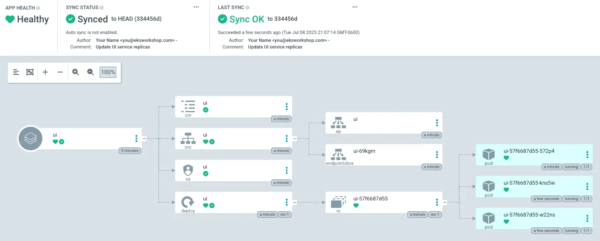

Now we can use Argo CD and Helm to configure the chart using GitOps. For example, we can increase the number of `replicas` for `ui` deployment to `3`.

Let's use a `values.yaml` to configures the number of replicas:

::yaml{file="manifests/modules/automation/gitops/argocd/update-application/values.yaml"}

Copy the file to the Git repository directory:

```bash
$ cp ~/environment/eks-workshop/modules/automation/gitops/argocd/update-application/values.yaml \
  ~/environment/argocd/ui
```

Our Git directory should now look something like this:

```bash
$ tree ~/environment/argocd
`-- ui
    |-- Chart.yaml
    `-- values.yaml
```

Then push the changes:

```bash
$ git -C ~/environment/argocd add .
$ git -C ~/environment/argocd commit -am "Update UI service replicas"
$ git -C ~/environment/argocd push
```

Click `Refresh` and `Sync` in ArgoCD UI or use `argocd` CLI to `Sync` the application:

```bash
$ argocd app sync ui
$ argocd app wait ui --timeout 120
```

We should have now 3 pods in `ui` deployment:



To verify, run the following commands:

```bash hook=update
$ kubectl get deployment -n ui ui
NAME   READY   UP-TO-DATE   AVAILABLE   AGE
ui     3/3     3            3           3m33s
$ kubectl get pod -n ui
NAME                 READY   STATUS    RESTARTS   AGE
ui-6d5bb7b95-hzmgp   1/1     Running   0          61s
ui-6d5bb7b95-j28ww   1/1     Running   0          61s
ui-6d5bb7b95-rjfxd   1/1     Running   0          3m34s
```
