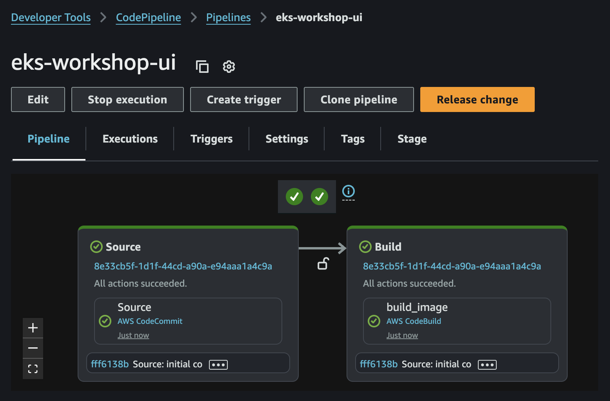
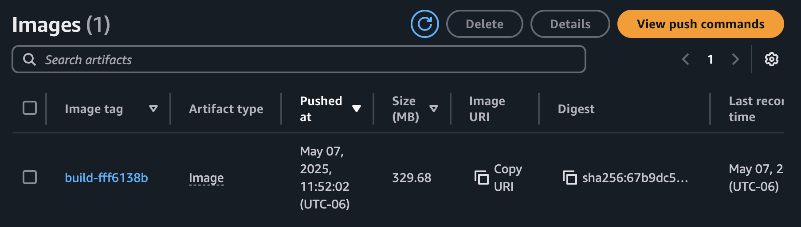

First, we'll need to populate the separate the CodeCommit repository we're using as our "application source repository". Clone it:

```bash
$ git clone ssh://${GITOPS_IAM_SSH_KEY_ID}@git-codecommit.${AWS_REGION}.amazonaws.com/v1/repos/${EKS_CLUSTER_NAME}-retail-store-sample ~/environment/retail-store-sample-codecommit
```

Next we'll populate it with a dummy Dockerfile that will allow us to create a container image:

```file
manifests/modules/automation/gitops/flux/pipeline/Dockerfile
```

Copy this to the application sources repository:

```bash
$ cp ~/environment/eks-workshop/modules/automation/gitops/flux/pipeline/Dockerfile \
  ~/environment/retail-store-sample-codecommit
```

We'll use AWS CodeBuild and define `buildspec.yml` to build our container image and push it to a private ECR repository:

```file
manifests/modules/automation/gitops/flux/pipeline/buildspec.yml
```

Copy this to the application sources repository:

```bash
$ cp ~/environment/eks-workshop/modules/automation/gitops/flux/pipeline/buildspec.yml \
  ~/environment/retail-store-sample-codecommit
```

Now we are ready to push our changes to CodeCommit and start the CodePipeline

```bash
$ git -C ~/environment/retail-store-sample-codecommit add .
$ git -C ~/environment/retail-store-sample-codecommit commit -am "initial commit"
$ git -C ~/environment/retail-store-sample-codecommit push --set-upstream origin main
```

You can navigate to CodePipeline in the AWS Console and explore the `eks-workshop-retail-store-sample` pipeline:

<ConsoleButton url="https://console.aws.amazon.com/codesuite/codepipeline/pipelines/eks-workshop-retail-store-sample/view" service="codepipeline" label="Open CodePipeline console"/>

It should look something like this:



If you want to wait until the pipeline has executed then run this:

```bash timeout=900 wait=30
$ REVISION_ID=$(git -C ~/environment/retail-store-sample-codecommit rev-parse HEAD)
$ while [[ "$(aws codepipeline list-pipeline-executions --pipeline-name ${EKS_CLUSTER_NAME}-ui --query "pipelineExecutionSummaries[?sourceRevisions[?revisionId=='$REVISION_ID']].status" --output text)" != "Succeeded" ]]; do echo "Waiting for pipeline to execute..."; sleep 10; done; echo "Done!"
```

Once the pipeline execution has completed a new image will have been published to ECR. Navigate to ECR in the AWS console and review the repository:

<ConsoleButton url="https://console.aws.amazon.com/ecr/private-registry/repositories" service="ecr" label="Open ECR console"/>

You will see something like this:


