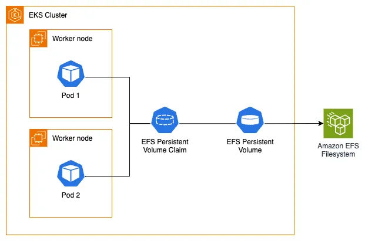

Before diving into this section, you should be familiar with the Kubernetes storage objects (volumes, persistent volumes (PV), persistent volume claims (PVC), dynamic provisioning and ephemeral storage) that were introduced in the main [Storage](../index.md) section.

The [Amazon Elastic File System Container Storage Interface (CSI) Driver](https://github.com/kubernetes-sigs/aws-efs-csi-driver) enables you to run stateful containerized applications by providing a CSI interface that allows Kubernetes clusters running on AWS to manage the lifecycle of Amazon EFS file systems.

The following architecture diagram illustrates how we will use EFS as persistent storage for our EKS pods:



To utilize Amazon EFS with dynamic provisioning on our EKS cluster, we first need to confirm that we have the EFS CSI Driver installed. The driver implements the CSI specification which allows container orchestrators to manage Amazon EFS file systems throughout their lifecycle.

For improved security and simplified management, you can run the Amazon EFS CSI driver as an Amazon EKS add-on. Since the required IAM role has already been created for us, we can proceed with installing the add-on:

```bash timeout=300 wait=60
$ aws eks create-addon --cluster-name $EKS_CLUSTER_NAME --addon-name aws-efs-csi-driver \
  --service-account-role-arn $EFS_CSI_ADDON_ROLE
$ aws eks wait addon-active --cluster-name $EKS_CLUSTER_NAME --addon-name aws-efs-csi-driver
```

Let's examine what the add-on has created in our EKS cluster. For example, a DaemonSet that runs a Pod on each node in our cluster:

```bash
$ kubectl get daemonset efs-csi-node -n kube-system
NAME           DESIRED   CURRENT   READY   UP-TO-DATE   AVAILABLE   NODE SELECTOR                 AGE
efs-csi-node   3         3         3       3            3           kubernetes.io/os=linux        47s
```

The EFS CSI driver supports both dynamic and static provisioning. For dynamic provisioning, the driver creates an access point for each PersistentVolume, but requires an existing AWS EFS file system that must be specified in the StorageClass parameters. Static provisioning also requires a pre-created AWS EFS file system, which can then be mounted as a volume inside a container using the driver.

An EFS file system has been provisioned for us, along with mount targets and the required security group that includes an inbound rule allowing NFS traffic to the EFS mount points. Let's get its ID which we'll need later:

```bash
$ export EFS_ID=$(aws efs describe-file-systems --query "FileSystems[?Name=='$EKS_CLUSTER_NAME-efs-assets'] | [0].FileSystemId" --output text)
$ echo $EFS_ID
fs-061cb5c5ed841a6b0
```

Next, we'll create a [StorageClass](https://kubernetes.io/docs/concepts/storage/storage-classes/) object configured to use our pre-provisioned EFS file system and [EFS Access points](https://docs.aws.amazon.com/efs/latest/ug/efs-access-points.html) in provisioning mode.

Using Kustomize, we'll create the storage class and inject the `EFS_ID` environment variable into the `filesystemid` parameter:

```file
manifests/modules/fundamentals/storage/efs/storageclass/efsstorageclass.yaml
```

Apply the kustomization:

```bash
$ kubectl kustomize ~/environment/eks-workshop/modules/fundamentals/storage/efs/storageclass \
  | envsubst | kubectl apply -f-
storageclass.storage.k8s.io/efs-sc created
```

Let's examine the StorageClass. Note that it uses the EFS CSI driver as the provisioner and is configured for EFS access point provisioning mode with the file system ID we exported earlier:

```bash
$ kubectl get storageclass
NAME            PROVISIONER             RECLAIMPOLICY   VOLUMEBINDINGMODE      ALLOWVOLUMEEXPANSION   AGE
efs-sc          efs.csi.aws.com         Delete          Immediate              false                  8m29s
$ kubectl describe sc efs-sc
Name:            efs-sc
IsDefaultClass:  No
Annotations:     kubectl.kubernetes.io/last-applied-configuration={"apiVersion":"storage.k8s.io/v1","kind":"StorageClass","metadata":{"annotations":{},"name":"efs-sc"},"parameters":{"directoryPerms":"700","fileSystemId":"fs-061cb5c5ed841a6b0","provisioningMode":"efs-ap"},"provisioner":"efs.csi.aws.com"}

Provisioner:           efs.csi.aws.com
Parameters:            directoryPerms=700,fileSystemId=fs-061cb5c5ed841a6b0,provisioningMode=efs-ap
AllowVolumeExpansion:  <unset>
MountOptions:          <none>
ReclaimPolicy:         Delete
VolumeBindingMode:     Immediate
Events:                <none>
```

Now that we understand EKS StorageClass and the EFS CSI driver, we'll proceed to modify the UI component to use the EFS `StorageClass` with Kubernetes dynamic volume provisioning and a PersistentVolume for storing product images.
